# 测试结果
[TOC]
## beebs_cover 11%
开
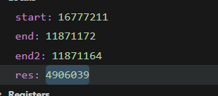
不开随机化：
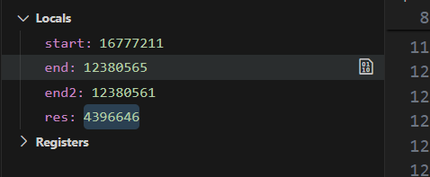

main->initialise_benchmark
main->benchmark -------
main->verify_benchmark -------
benchmark->swi10 -----------
benchmark->swi50 -----------
benchmark->swi120

{0x8055c35, 216, -1, 0},  //main 0
{0x80569bd, 2, -1, 0},  //initialise_benchmark 0
{0x80569bf, 64, -1, 0},  //benchmark 1
{0x80569ff, 34, -1, 0},  //verify_benchmark 1
{0x8055d69, 1968, -1, 0},  //swi120 0
{0x8056519, 1006, -1, 0},  //swi50 0
{0x8056907, 182, -1, 0},  //swi10 1

这里开销是因为swi120/swi50/swi10这三个函数巨长。。。。。trampoline的开销不算什么

## beebs_compress 48.69%
开
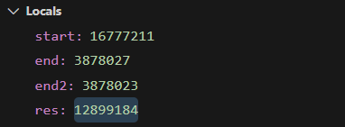
不开
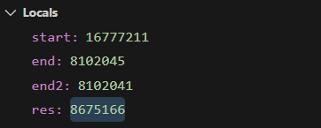

main->initialise_benchmark ----
main->benchmark 
main->verify_benchmark ---------
benchmark->compress
compress->getbyte-------
compress->cl_hash
while{
compress->getbyte-----
compress->cl_block-------
cl_block->cl_hash------
cl_block->output---------
output->putbyte---------
output->writebytes
}

{0x8055c35, 218, 0, 0},  //main
{0x8055d73, 2, 1, 0},  //initialise_benchmark
{0x8055d75, 86, 0, 0},  //benchmark
{0x8055d6b, 8, 1, 0},  //verify_benchmark
{0x8055dcb, 642, 1, 0},  //compress
{0x805604d, 86, 0, 0},  //getbyte
{0x80560a3, 226, 1, 0},  //cl_hash
{0x8056185, 226, 0, 0},  //cl_block
{0x8056267, 674, 1, 0},  //output
{0x8056509, 30, 0, 0},  //putbyte
{0x8056527, 86, 1, 0},  //writebytes

很明显，while循环反复调用的函数中，需要trampoline的太多了。。。

做出的优化是：
将getbyte和putbyte的region手动设置为1
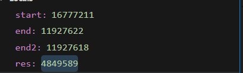(图里是500次循环，上面两张图是1000的)
降为11.80%

## beebs_fdct 7.81%
循环500次
开：
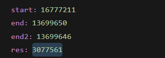
不开：
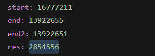
    {0x8055d85, 218, 0, 0},  //main
    {0x805634f, 2, 1, 0},  //initialise_benchmark
    {0x8056351, 48, 0, 0},  //benchmark
    {0x8056381, 42, 0, 0},  //verify_benchmark
    {0x805647f, 132, 1, 0},  //trampoline_A_B
    {0x8056503, 132, 1, 0},  //trampoline_B_A
    {0x8056587, 270, 1, 0},  //trampoline_blx
    {0x8055ebb, 1172, 1, 0},  //fdct
    {0x8055ad7, 222, 1, 0},  //Reset_Handler
    {0x8055259, 236, 0, 0},  //memcpy
    {0x80551f5, 100, 0, 0},  //memcmp


## beebs_cnt 81.53% 81.54%（舍弃）
开
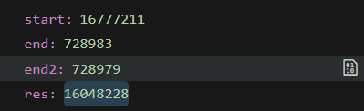
不开
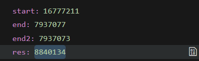

第二次测 循环500次
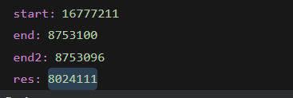
不开：
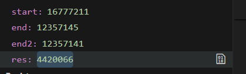

main->initialise_benchmark
main->benchmark 
main->verify_benchmark ---------
initialise_benchmark->InitSeed ---------
initialise_benchmark->Initialize
Initialize->RandomInteger--------
benchmark->Test----------
Test->Sum--------


{0x8055c35, 216, 0, 0},  //main
{0x8055ee1, 30, 0, 0},  //initialise_benchmark
{0x8055d69, 18, 0, 0},  //benchmark
{0x8055eff, 40, 1, 0},  //verify_benchmark
{0x8055d7b, 34, 1, 0},  //Test
{0x8055d9d, 168, 0, 0},  //Sum
{0x8055e45, 98, 0, 0},  //Initialize
{0x8055ea7, 44, 1, 0},  //RandomInteger
{0x8055ed3, 14, 1, 0},  //InitSeed

调用流程和cover一样简单，但是这里的函数体比较短，trampoline的开销相对来说比较大

## beebs_levenshtein 11.17%
开
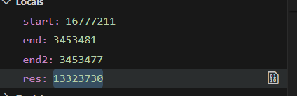

不开
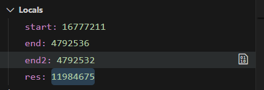


main->initialise_benchmark ---------
main->benchmark 
main->verify_benchmark
```cpp
 for(i = 0; i < 5; ++i)
    for(j = 0; j < 5; ++j)
      benchmark->levenshtein_distance
```

levenshtein_distance->min(多多次循环) -----------------
```cpp
for (j = 1; j <= tl; j++) {
    for (i = 1; i <= sl; i++) {
        if (s[i - 1] == t[j - 1]) {
            d[i][j] = d[i - 1][j - 1];
        }
        else {
            d[i][j] = min(d[i - 1][j] + 1,  /* deletion */
                            min(d[i][j - 1] + 1,  /* insertion */
                                d[i - 1][j - 1] + 1));    /* substitution */
        }
    }
}
```
levenshtein_distance->strlen


{0x8055c91, 216, 0, 0},  //main
{0x8055faf, 2, 1, 0},  //initialise_benchmark
{0x8055fb1, 100, 0, 0},  //benchmark
{0x8056015, 34, 0, 0},  //verify_benchmark
{0x8055dc5, 462, 0, 0},  //levenshtein_distance
{0x8055f93, 28, 1, 0},  //min
{0x80551f5, 92, 0, 0},  //strlen

这里函数划分很巧，大部分都在第一部分

## beebs_ns 25%
开
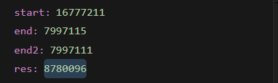
不开
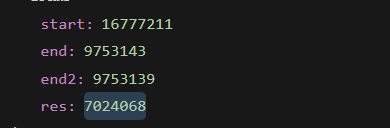

main->initialise_benchmark -----------
main->benchmark 
main->verify_benchmark----------
benchmark->foo ----------


{0x8055c35, 218, 0, 0},  //main
{0x8055e67, 2, 1, 0},  //initialise_benchmark
{0x8055e69, 18, 0, 0},  //benchmark
{0x8055e5f, 8, 1, 0},  //verify_benchmark
{0x8055d6b, 244, 1, 0},  //foo

这里函数调用比较简单，没有循环调用，只用了三次trampoline
但foo函数体不算长，故而性能开销一般

## beebs_prime 10.25%
开
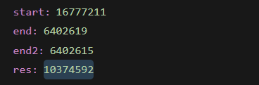
不开
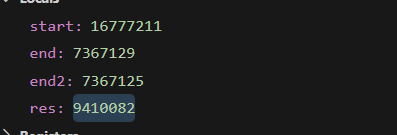

main->initialise_benchmark
main->benchmark ------------
main->verify_benchmark --------
benchmark->swap ---------
benchmark->prime
prime->even
prime->divide

    {0x8055c35, 218, 0, 0},  //main
    {0x8055ea9, 34, 0, 0},  //initialise_benchmark
    {0x8055e4b, 94, 1, 0},  //benchmark
    {0x8055ecb, 42, 1, 0},  //verify_benchmark
    {0x8055d6b, 28, 1, 0},  //divides
    {0x8055d87, 28, 1, 0},  //even
    {0x8055da3, 122, 1, 0},  //prime
    {0x8055e1d, 46, 0, 0},  //swap

函数体偏短
但只trampoline了三次


## beebs_ndes 27.34%
开
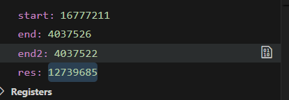
不开
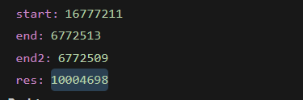

main->initialise_benchmark ----------
main->benchmark 
main->verify_benchmark --------
benchmark->des -------
des->getbit(for) ----------
des->cyfun(for)
des->ks(for)
ks->getbit(for) --------

{0x8055c35, 218, 0, 0},  //main
{0x8056417, 56, 1, 0},  //initialise_benchmark
{0x80563d9, 62, 0, 0},  //benchmark
{0x805644f, 82, 1, 0},  //verify_benchmark
{0x8055d6b, 714, 1, 0},  //des
{0x8056035, 86, 0, 0},  //getbit
{0x805608b, 336, 1, 0},  //ks
{0x80561db, 510, 1, 0},  //cyfun

循环中trampoline触发较多

## beebs_fibcall 34.19%
开
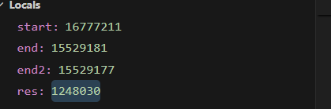
不开
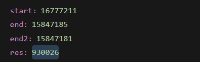

main->initialise_benchmark
main->benchmark -------
main->verify_benchmark
benchmark->fib -------

{0x8055c35, 216, 0, 0},  //main
{0x8055dbd, 2, 0, 0},  //initialise_benchmark
{0x8055dbf, 32, 1, 0},  //benchmark
{0x8055ddf, 40, 1, 0},  //verify_benchmark
{0x8055d69, 84, 0, 0},  //fib

本身函数运行的很快！emmmmmm fib函数太短了，函数调用也很简单。一共四次函数调用，两次触发了trampoline

## beebs_statemate 23.20%
开
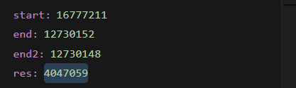
不开
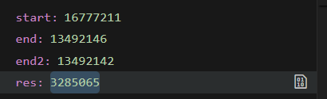

    {0x8055ced, 218, 0, 0},  //main
    {0x80564a5, 60, 0, 0},  //initialise_benchmark
    {0x8056487, 30, 1, 0},  //benchmark
    {0x80564e1, 314, 0, 0},  //verify_benchmark
    {0x805666f, 132, 1, 0},  //trampoline_A_B
    {0x80566f3, 132, 1, 0},  //trampoline_B_A
    {0x8056777, 270, 1, 0},  //trampoline_blx
    {0x8055e23, 136, 1, 0},  //interface
    {0x8055eab, 114, 1, 0},  //init
    {0x8055f1d, 164, 0, 0},  //generic_KINDERSICHERUNG_CTRL
    {0x8055fc1, 594, 0, 0},  //generic_FH_TUERMODUL_CTRL
    {0x8056213, 64, 1, 0},  //generic_EINKLEMMSCHUTZ_CTRL
    {0x8056253, 120, 1, 0},  //generic_BLOCK_ERKENNUNG_CTRL
    {0x80562cb, 444, 1, 0},  //FH_DU
    {0x8055a3f, 222, 1, 0},  //Reset_Handler
    {0x80551f5, 6, 0, 0},  //__aeabi_memclr
    {0x80551f5, 6, 0, 0},  //__aeabi_memclr8
    {0x80551f5, 6, 0, 0},  //__aeabi_memclr4
    {0x80551fd, 10, 0, 0},  //__aeabi_memset
    {0x80551fd, 10, 0, 0},  //__aeabi_memset8
    {0x80551fd, 10, 0, 0},  //__aeabi_memset4
    {0x8055209, 164, 0, 0},  //memset

## beebs_tarai 19.86%
开
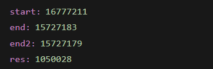
不开
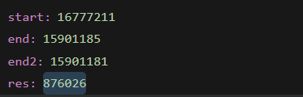


{0x8055c35, 216, 0, 0},  //main
{0x8055e37, 34, 1, 0},  //initialise_benchmark
{0x8055de9, 78, 0, 0},  //benchmark
{0x8055e59, 34, 0, 0},  //verify_benchmark
{0x8055d69, 128, 0, 0},  //tarai

project很简单，但是函数划分很巧，几乎都在region 1，触发了一次trampoline


## GPIOEXTI 0%
开
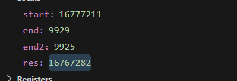
不开
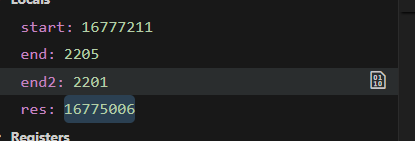

要注释掉main_ex函数中SystemClock_Config()的调用
    {0x8055c89, 218, 0, 0},  //main
    {0x8057357, 218, 1, 0},  //main
    {0x8055f4d, 2, 0, 0},  //initialise_benchmark
    {0x8055f57, 18, 1, 0},  //benchmark
    {0x8055f4f, 8, 1, 0},  //verify_benchmark
    {0x8055fc7, 132, 1, 0},  //trampoline_A_B
    {0x805604b, 132, 1, 0},  //trampoline_B_A
    {0x80560cf, 270, 1, 0},  //trampoline_blx
    {0x8055dcd, 216, 0, 0},  //BSP_LED_Init
    {0x8055ea5, 58, 0, 0},  //main_ex
    {0x8055edf, 2, 1, 0},  //MX_ICACHE_Init
    {0x8055ee1, 108, 0, 0},  //EXTI13_IRQHandler_Config


## GPIOIOToggle -0.05%
开
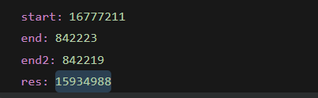
不开
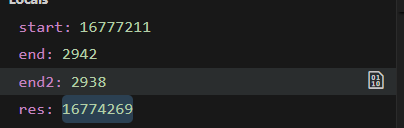
    {0x8055c69, 218, 0, 0},  //main
    {0x8055e75, 2, 0, 0},  //initialise_benchmark
    {0x8055e7f, 18, 1, 0},  //benchmark
    {0x8055e77, 8, 1, 0},  //verify_benchmark
    {0x80551f5, 78, 0, 0},  //HAL_Init
    {0x8055dad, 76, 0, 0},  //main_ex
    {0x8055df9, 122, 0, 0},  //MX_GPIO_Init.19
    {0x8055e73, 2, 1, 0},  //MX_ICACHE_Init
    {0x80557bb, 52, 1, 0},  //HAL_GPIO_TogglePin

## RCCClockConfig 0%
开
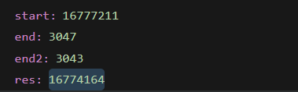
不开
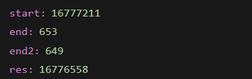


    {0x80552ad, 80, 0, 0},  //HAL_Init
    {0x8057329, 218, 0, 0},  //main
    {0x8057aa3, 2, 1, 0},  //initialise_benchmark
    {0x8057aad, 18, 0, 0},  //benchmark
    {0x8057aa5, 8, 0, 0},  //verify_benchmark
    {0x8057b2b, 132, 1, 0},  //trampoline_A_B
    {0x8057baf, 132, 1, 0},  //trampoline_B_A
    {0x8057c33, 270, 1, 0},  //trampoline_blx
    {0x8057477, 216, 1, 0},  //BSP_LED_Init
    {0x805754f, 60, 1, 0},  //BSP_LED_On
    {0x805758b, 60, 1, 0},  //BSP_LED_Toggle
    {0x80575c7, 352, 1, 0},  //BSP_PB_Init
    {0x8057727, 18, 1, 0},  //BUTTON_USER_EXTI_Callback
    {0x8057739, 12, 0, 0},  //BSP_PB_Callback
    {0x8057745, 156, 0, 0},  //main_ex
    {0x80577e1, 86, 0, 0},  //SystemClock_Config
    {0x8057837, 2, 1, 0},  //MX_ICACHE_Init
    {0x8057839, 88, 0, 0},  //SwitchSystemClock
    {0x8057891, 250, 0, 0},  //SystemClockMSI_Config
    {0x805798b, 248, 1, 0},  //SystemClockHSI_Config
    {0x8057a83, 32, 1, 0},  //Error_Handler
    {0x805707b, 222, 1, 0},  //Reset_Handler
    {0x80551f5, 6, 0, 0},  //__aeabi_memclr
    {0x80551f5, 6, 0, 0},  //__aeabi_memclr8
    {0x80551f5, 6, 0, 0},  //__aeabi_memclr4
    {0x80551fd, 10, 0, 0},  //__aeabi_memset
    {0x80551fd, 10, 0, 0},  //__aeabi_memset8
    {0x80551fd, 10, 0, 0},  //__aeabi_memset4
    {0x8055209, 164, 0, 0},  //memset

## embench+aha-mont64 18.06%
开
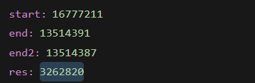
不开
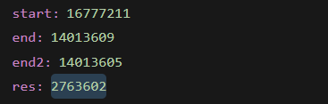

    {0x8055c35, 214, 0, 0},  //main
    {0x8056449, 34, 0, 0},  //initialise_benchmark
    {0x805614b, 18, 1, 0},  //benchmark
    {0x805646b, 8, 1, 0},  //verify_benchmark
    {0x80564c7, 132, 1, 0},  //trampoline_A_B
    {0x805654b, 132, 1, 0},  //trampoline_B_A
    {0x80565cf, 270, 1, 0},  //trampoline_blx
    {0x8055d67, 254, 1, 0},  //mulul64
    {0x8055e65, 188, 0, 0},  //modul64
    {0x8055f21, 338, 0, 0},  //montmul
    {0x8056073, 216, 1, 0},  //xbinGCD
    {0x805615d, 748, 0, 0},  //benchmark_body


## embench_matmult-int 6.42%
开：
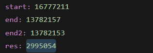
不开
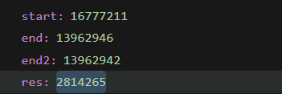

    {0x8055d89, 216, 0, 0},  //main
    {0x8056051, 190, 0, 0},  //initialise_benchmark
    {0x8055ebd, 18, 0, 0},  //benchmark
    {0x805610f, 72, 1, 0},  //verify_benchmark
    {0x8055ecf, 116, 1, 0},  //benchmark_body
    {0x8055f43, 58, 1, 0},  //Test
    {0x8055f7d, 154, 0, 0},  //Multiply
    {0x8056017, 14, 1, 0},  //InitSeed
    {0x8056025, 44, 0, 0},  //RandomInteger
    {0x80551f5, 100, 0, 0},  //memcmp
    {0x8055259, 236, 0, 0},  //memcpy
    {0x8055345, 4, 0, 0},  //__aeabi_memcpy
    {0x8055345, 4, 0, 0},  //__aeabi_memcpy8
    {0x8055345, 4, 0, 0},  //__aeabi_memcpy4

## embench_md5sum 11.61%
开
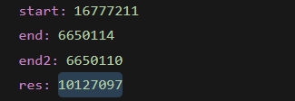
不开
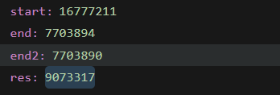

    {0x8058bb9, 214, 0, 0},  //main
    {0x8058f4f, 2, 1, 0},  //initialise_benchmark
    {0x8058f51, 18, 0, 0},  //benchmark
    {0x8059019, 8, 0, 0},  //verify_benchmark
    {0x805961b, 132, 1, 0},  //trampoline_A_B
    {0x805969f, 132, 1, 0},  //trampoline_B_A
    {0x8059723, 270, 1, 0},  //trampoline_blx
    {0x8058ceb, 612, 1, 0},  //md5
    {0x805912d, 68, 0, 0},  //calloc_beebs
    {0x8059171, 8, 0, 0},  //free_beebs
    {0x8058f63, 182, 1, 0},  //benchmark_body
    {0x8059021, 116, 0, 0},  //init_heap_beebs
    {0x8059095, 152, 0, 0},  //malloc_beebs
    {0x805890b, 222, 1, 0},  //Reset_Handler
    {0x8055269, 236, 0, 0},  //memcpy
    {0x80551f5, 60, 0, 0},  //__assert_func
    {0x8055355, 164, 0, 0},  //memset
    {0x8055231, 14, 0, 0},  //abort
    {0x8058175, 4, 0, 0},  //__aeabi_memcpy
    {0x8058175, 4, 0, 0},  //__aeabi_memcpy8
    {0x8058175, 4, 0, 0},  //__aeabi_memcpy4
    {0x8055241, 40, 0, 0},  //fiprintf
    {0x80553f9, 92, 0, 0},  //raise
    {0x8057e55, 2, 0, 0},  //_exit
    {0x8057149, 36, 0, 0},  //_close_r
    {0x8056e01, 204, 0, 0},  //_fclose_r
    {0x8056ecd, 312, 0, 0},  //__sflush_r
    {0x8057005, 90, 0, 0},  //_fflush_r
    {0x8056c89, 12, 0, 0},  //_cleanup_r
    {0x8056c95, 272, 0, 0},  //__sinit
    {0x8056da5, 12, 0, 0},  //__sfp_lock_acquire
    {0x8056db1, 12, 0, 0},  //__sfp_lock_release
    {0x8055d65, 3424, 0, 0},  //_vfiprintf_r
    {0x8056b45, 162, 0, 0},  //__fputwc
    {0x8056be9, 102, 0, 0},  //_fputwc_r
    {0x8055a15, 160, 0, 0},  //_malloc_trim_r
    {0x8055ab5, 524, 0, 0},  //_free_r
    {0x8057d65, 44, 0, 0},  //_fstat_r
    {0x805716d, 748, 0, 0},  //__sfvwrite_r
    {0x8056dbd, 66, 0, 0},  //_fwalk_reent
    {0x8057d91, 36, 0, 0},  //_isatty_r
    {0x8056c51, 12, 0, 0},  //__locale_mb_cur_max
    {0x80579b5, 8, 0, 0},  //_localeconv_r
    {0x80559e1, 2, 0, 0},  //__retarget_lock_init_recursive
    {0x80559e5, 2, 0, 0},  //__retarget_lock_close_recursive
    {0x80559e9, 2, 0, 0},  //__retarget_lock_acquire_recursive
    {0x80559ed, 2, 0, 0},  //__retarget_lock_release_recursive
    {0x805711d, 44, 0, 0},  //_lseek_r
    {0x8057c85, 224, 0, 0},  //__smakebuf_r
    {0x8055455, 1396, 0, 0},  //_malloc_r
    {0x8056c5d, 42, 0, 0},  //__ascii_mbtowc
    {0x8057551, 122, 0, 0},  //memchr
    {0x8057459, 248, 0, 0},  //memmove
    {0x80559c9, 12, 0, 0},  //__malloc_lock
    {0x80559d5, 12, 0, 0},  //__malloc_unlock
    {0x80570f1, 44, 0, 0},  //_read_r
    {0x80575cd, 1000, 0, 0},  //_realloc_r
    {0x80559f1, 36, 0, 0},  //_sbrk_r
    {0x8055ced, 4, 0, 0},  //_getpid_r
    {0x8055cc1, 44, 0, 0},  //_kill_r
    {0x8057e25, 32, 0, 0},  //_sbrk
    {0x8057df5, 16, 0, 0},  //_kill
    {0x8057dd5, 16, 0, 0},  //_getpid
    {0x8057061, 34, 0, 0},  //__sread
    {0x8057085, 62, 0, 0},  //__swrite
    {0x80570c5, 36, 0, 0},  //__sseek
    {0x80570e9, 8, 0, 0},  //__sclose
    {0x80579bd, 92, 0, 0},  //strlen
    {0x8057a19, 100, 0, 0},  //strncpy
    {0x8057bb1, 212, 0, 0},  //__swsetup_r
    {0x8057b2d, 60, 0, 0},  //_wcrtomb_r
    {0x8057a7d, 176, 0, 0},  //__swbuf_r
    {0x8057b69, 28, 0, 0},  //__ascii_wctomb
    {0x8057b85, 44, 0, 0},  //_write_r
    {0x8057e15, 16, 0, 0},  //_read
    {0x8057e05, 16, 0, 0},  //_lseek
    {0x8057db5, 16, 0, 0},  //_close
    {0x8057e45, 16, 0, 0},  //_write
    {0x8057dc5, 16, 0, 0},  //_fstat
    {0x8057de5, 16, 0, 0},  //_isatty
    
## embench_primecount 68.32%
main里面运行一次时间就够了
开：
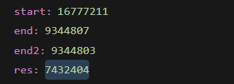
不开
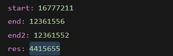

    {0x8055c35, 214, 0, 0},  //main
    {0x8055e91, 2, 0, 0},  //initialise_benchmark
    {0x8055e47, 18, 1, 0},  //benchmark
    {0x8055e93, 8, 1, 0},  //verify_benchmark
    {0x8055eef, 132, 1, 0},  //trampoline_A_B
    {0x8055f73, 132, 1, 0},  //trampoline_B_A
    {0x8055ff7, 270, 1, 0},  //trampoline_blx
    {0x8055d67, 224, 1, 0},  //countPrimes
    {0x8055e59, 56, 0, 0},  //benchmark_body

## embench_nsichneu 6.03%
开：
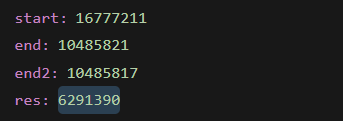
不开：
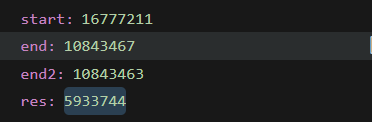

    {0x8055c35, 216, 0, 0},  //main
    {0x8055d69, 2, 0, 0},  //initialise_benchmark
    {0x8055d6b, 18, 1, 0},  //benchmark
    {0x805b89f, 360, 1, 0},  //verify_benchmark
    {0x805ba5b, 132, 1, 0},  //trampoline_A_B
    {0x805badf, 132, 1, 0},  //trampoline_B_A
    {0x805bb63, 270, 1, 0},  //trampoline_blx
    {0x8055d7d, 23330, 0, 0},  //benchmark_body

## embench_slre 16.18%
开
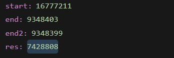
不开
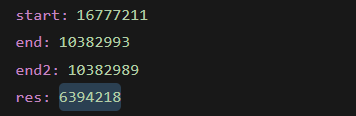

    {0x8055dc1, 214, 0, 0},  //main
    {0x805700b, 2, 1, 0},  //initialise_benchmark
    {0x805700d, 18, 0, 0},  //benchmark
    {0x805709d, 8, 0, 0},  //verify_benchmark
    {0x8057247, 132, 1, 0},  //trampoline_A_B
    {0x80572cb, 132, 1, 0},  //trampoline_B_A
    {0x805734f, 270, 1, 0},  //trampoline_blx
    {0x8055ef3, 174, 1, 0},  //slre_match
    {0x8055fa1, 718, 0, 0},  //foo
    {0x805626f, 64, 1, 0},  //get_op_len
    {0x80562af, 42, 1, 0},  //is_metacharacter
    {0x80562d9, 294, 0, 0},  //setup_branch_points
    {0x80563ff, 122, 1, 0},  //baz
    {0x8056fa7, 100, 1, 0},  //set_len
    {0x8056f79, 46, 0, 0},  //op_len
    {0x8056479, 218, 0, 0},  //doh
    {0x8056553, 1348, 1, 0},  //bar
    {0x8056a97, 50, 1, 0},  //is_quantifier
    {0x8056ac9, 548, 0, 0},  //match_set
    {0x8056ced, 466, 0, 0},  //match_op
    {0x8056ebf, 144, 1, 0},  //hextoi
    {0x8056f4f, 42, 1, 0},  //toi
    {0x805701f, 126, 1, 0},  //benchmark_body
    {0x8055b13, 222, 1, 0},  //Reset_Handler
    {0x80551f5, 100, 0, 0},  //memcmp
    {0x8055325, 92, 0, 0},  //strlen
    {0x8055259, 204, 0, 0},  //strchr

和statemate一样把rpt改成10次，main函数中循环50次

## embench_statemate 64.10%
开：
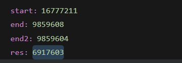
不开：
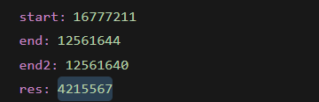

    {0x8055ced, 218, 0, 0},  //main
    {0x8056501, 2, 0, 0},  //initialise_benchmark
    {0x8056487, 18, 1, 0},  //benchmark
    {0x8056503, 314, 1, 0},  //verify_benchmark
    {0x805668f, 132, 1, 0},  //trampoline_A_B
    {0x8056713, 132, 1, 0},  //trampoline_B_A
    {0x8056797, 270, 1, 0},  //trampoline_blx
    {0x8055e23, 136, 1, 0},  //interface
    {0x8055eab, 114, 1, 0},  //init
    {0x8055f1d, 164, 0, 0},  //generic_KINDERSICHERUNG_CTRL
    {0x8055fc1, 594, 0, 0},  //generic_FH_TUERMODUL_CTRL
    {0x8056213, 64, 1, 0},  //generic_EINKLEMMSCHUTZ_CTRL
    {0x8056253, 120, 1, 0},  //generic_BLOCK_ERKENNUNG_CTRL
    {0x80562cb, 444, 1, 0},  //FH_DU
    {0x8056499, 104, 0, 0},  //benchmark_body
    {0x8055a3f, 222, 1, 0},  //Reset_Handler
    {0x80551f5, 164, 0, 0},  //memset
    {0x8055299, 6, 0, 0},  //__aeabi_memclr
    {0x8055299, 6, 0, 0},  //__aeabi_memclr8
    {0x8055299, 6, 0, 0},  //__aeabi_memclr4
    {0x80552a1, 10, 0, 0},  //__aeabi_memset
    {0x80552a1, 10, 0, 0},  //__aeabi_memset8
    {0x80552a1, 10, 0, 0},  //__aeabi_memset4

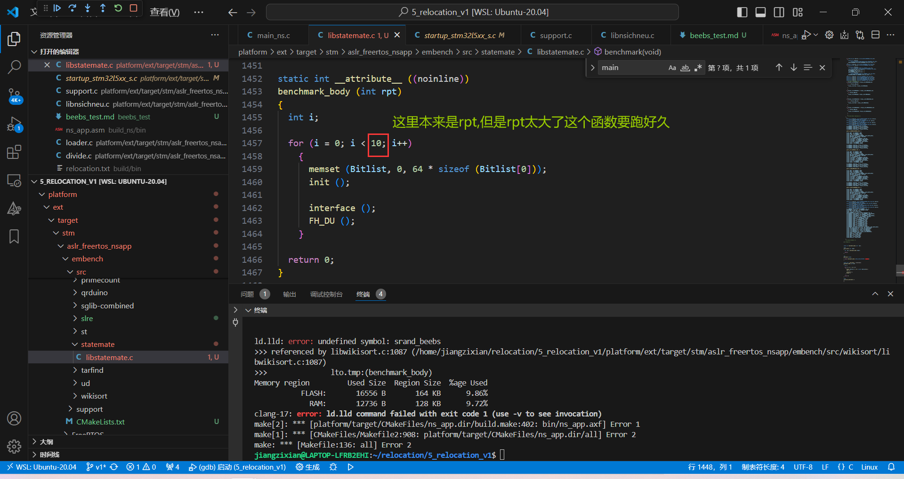

# 其他
1. nop的插入对性能开销的影响很小！大概上面图片中的res会少30左右，可忽略不计
2. 涉及到硬件方面的project，有关clock的跑不了

## 思考
- 循环中调用的函数，放在一个region。但有的project都没什么循环
- 本身project比较短（指令少）,overhead不可避免的比较大